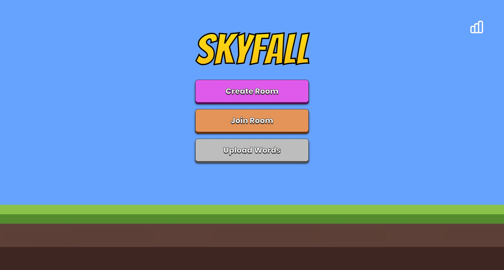
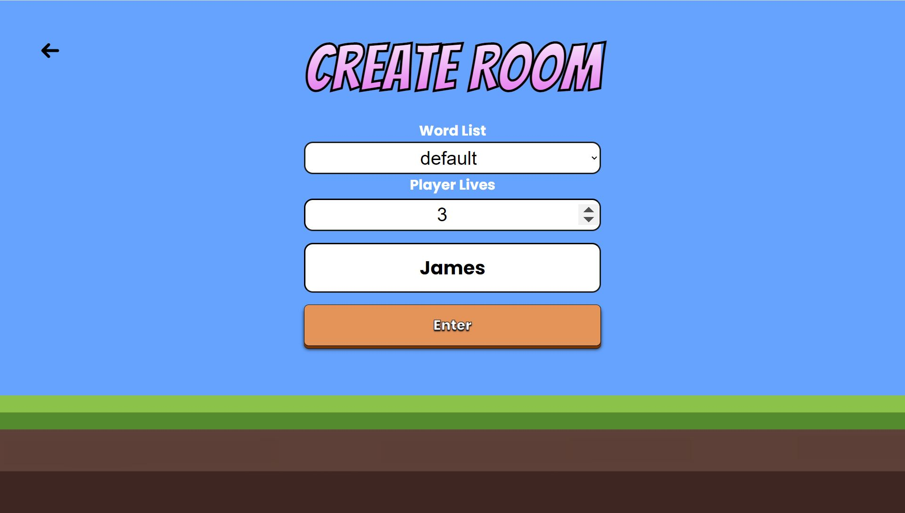
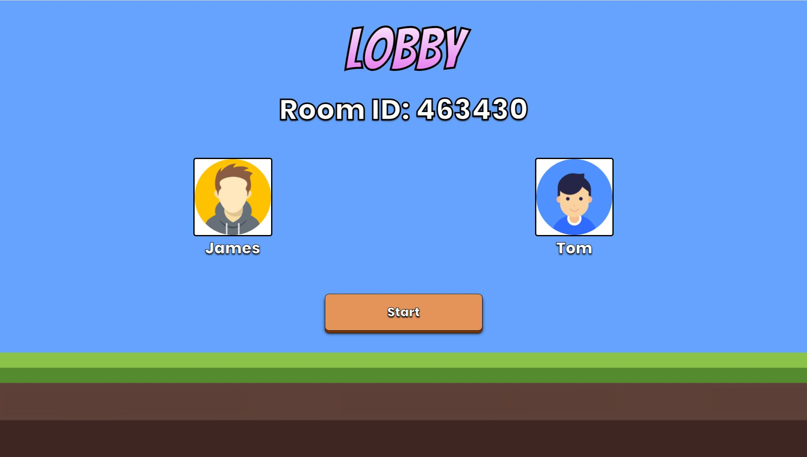
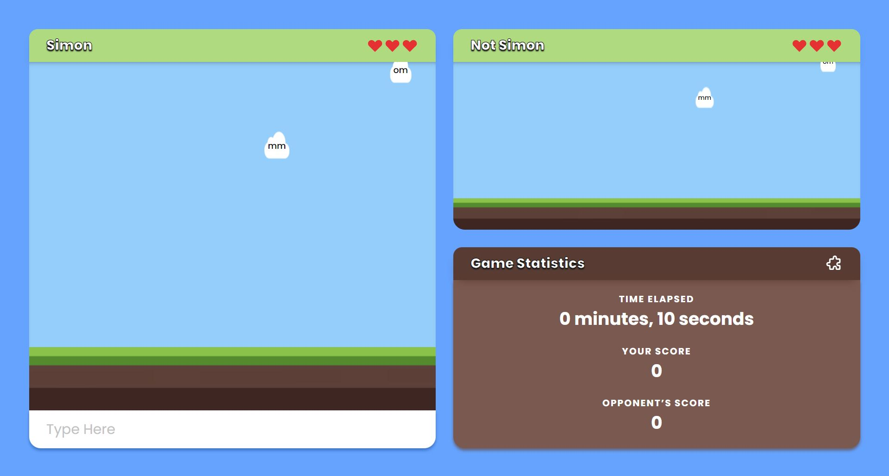
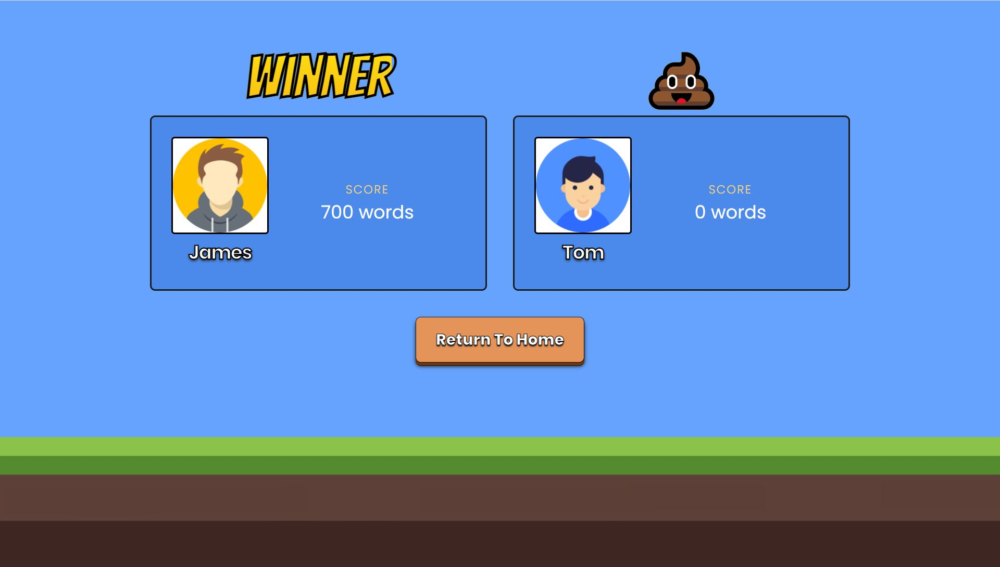
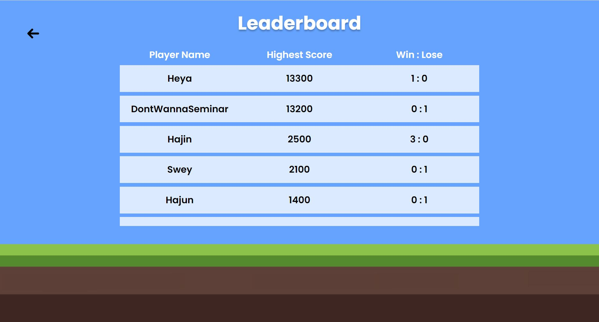
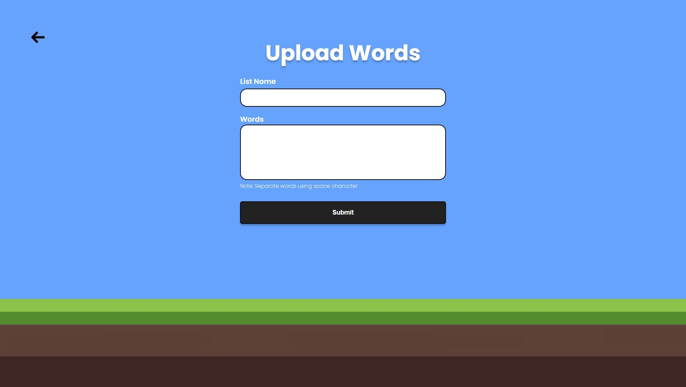

<h1 align="center">
  <br>
  
</h1>

<h4 align="center">The best typing game you will ever play</h4>

<p align="center">
  
  <a href="https://github.com/UOA-CS732-SE750-Students-2022/skyfall/actions/workflows/deploy.yml">
  </a>
</p>

<p align="center">
  <a href="#key-features">Features</a> •
  <a href="#installation">Installation</a> •
  <a href="https://github.com/UOA-CS732-SE750-Students-2022/skyfall/wiki">Wiki</a> •
  <a href="http://skyfall-game.herokuapp.com/">Demo</a>
</p>

## Key Features

- Hosting and joining a lobby
- Real time competitive typing game
- Game word list and life configuration
- Word list customisation
- Leaderboard

## Installation

To clone and run this application:

```shell
# Clone this repository
$ git clone https://github.com/UOA-CS732-SE750-Students-2022/skyfall

# Go into the repository
$ cd skyfall
```

After this has been cloned, please follow the instruction in [Frontend README](./frontend/README.md)
and [Backend README](./backend/README.md) to start running the application.

## Wiki

Please visit our wiki for the information of

- [Backend Meeting minutes](https://github.com/UOA-CS732-SE750-Students-2022/skyfall/wiki/Meeting-Minutes-(Backend))
- [Frontend Meeting minutes](https://github.com/UOA-CS732-SE750-Students-2022/skyfall/wiki/Meeting-Minutes-(Frontend))
- [Backend Api documentation](https://github.com/UOA-CS732-SE750-Students-2022/skyfall/wiki/Backend-endpoints)
- [Project workflow](https://github.com/UOA-CS732-SE750-Students-2022/skyfall/wiki/Project-Workflow)

## Screenshots

 






